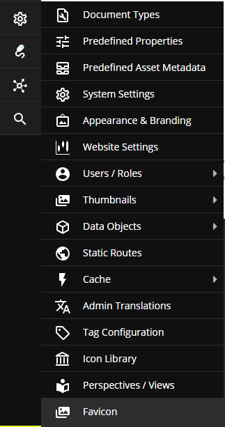
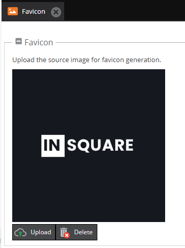

# OpenDXP Favicon Bundle

Generate favicon assets and manifest from a single uploaded image, with an admin module for upload and preview.

## Requirements

- PHP 8.3+
- Symfony 7.4
- OpenDXP 1.x (`open-dxp/opendxp:^1.0`, Admin UI Classic / ExtJS)

## Installation

```bash
composer require in-square/opendxp-favicon-bundle
```

Register the bundle in `config/bundles.php` if needed:

```php
<?php

return [
    // ...
    InSquare\OpendxpFaviconBundle\InSquareOpendxpFaviconBundle::class => ['all' => true],
];
```

Install assets and register permissions:

```bash
php bin/console assets:install
php bin/console opendxp:bundle:install InSquareOpendxpFaviconBundle
```

Grant the `favicon_settings` permission to the target roles/users (Admin -> Settings -> Users/Roles).

## Admin module

Open: **Settings -> Favicon**

- Upload a source image
- Preview the current source
- Delete the favicon set

### OpenDXP admin preview

Settings menu entry:



Favicon tab (upload/delete/preview):



Upload generates the full set of icons + `manifest.json` into:

```
/public/favicon
```

Delete clears `/public/favicon/*`.

## Generated sizes

- Apple touch: 57, 60, 72, 76, 114, 120, 144, 152, 180
- Android: 36, 48, 72, 96, 144, 192
- Favicon: 16, 32, 96
- MS tile: 144

## Twig rendering

Use in your base layout `<head>`:

```twig
{{ render_favicon() }}
```

The function returns the standard HTML tags (apple-touch-icon, icon, manifest, and meta tags). If required files are missing, it returns an empty string.

## Configuration

Create `config/packages/in_square_opendxp_favicon.yaml`:

```yaml
in_square_opendxp_favicon:
  theme_color: '#ffffff'
  tile_color: '#ffffff'
  manifest_name: 'App'
  manifest_base_path: '/favicon'
```

- `theme_color` -> `<meta name="theme-color">`
- `tile_color` -> `<meta name="msapplication-TileColor">`
- `manifest_name` -> `manifest.json` name
- `manifest_base_path` -> base path used in `manifest.json` icon `src`

## Notes

- Source file is saved as `/public/favicon/source.png`.
- Uploading a new image regenerates all files.
